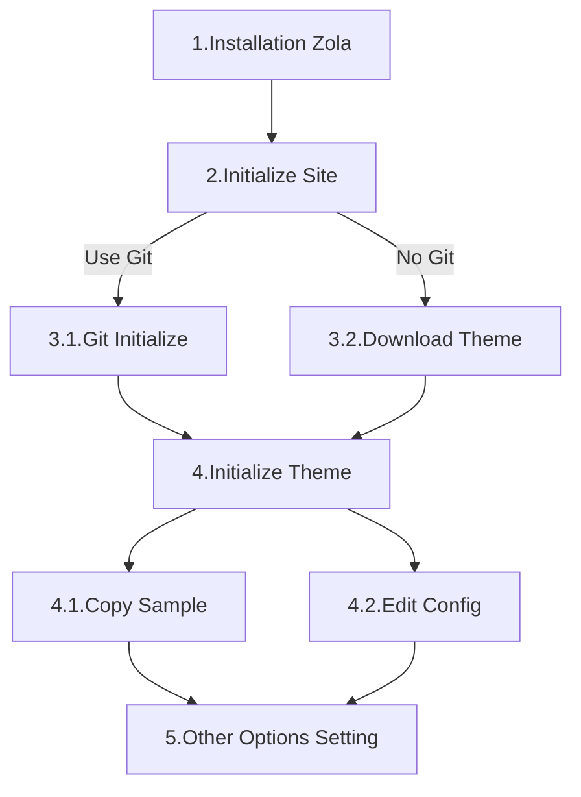

+++
title = "install"
date = 2025-05-01
weight=100
[taxonomies]
tags=["Theme"]
[extra]
image = "https://4yuinfo.github.io/zola-theme_jiufen/images/header002.png"
+++

# jiufen
The 'jiufen' theme is a theme that references the [W3.CSS](https://www.w3schools.com/w3css/)
Template and incorporates [ZOLA](https://www.getzola.org/)-related features.

Jiufen is the name of an old street located on the island of Formosa (Taiwan).
If you have the chance, you should definitely visit this island to experience life here.

{{imagew(path="https://4yuinfo.github.io/zola-theme_jiufen/images/screenshot.png")}}

## Installation




### 1.Install Zola
ZOLA DOCS [Installation](https://www.getzola.org/documentation/getting-started/installation/)

### 2.Initialize Site
ZOLA DOCS [Initialize Site](https://www.getzola.org/documentation/getting-started/overview/#initialize-site)


```sh
# rename [myblog]

zola init [myblog]

> What is the URL of your site? (https://example.com):
> Do you want to enable Sass compilation? [Y/n]: n
> Do you want to enable syntax highlighting? [y/N]: y
> Do you want to build a search index of the content? [y/N]: y

cd [myblog]
```


### 3.1.Git Initialize


```sh
git init;touch .gitignore
git submodule add https://github.com/4yuinfo/zola-theme_jiufen.git themes/jiufen
```


### 3.2.Download Theme
Download And Upzip to Theme

### 4.1 Copy Sample


```sh
mkdir -p content/posts
cp themes/jiufen/config.toml .
cp themes/jiufen/content/home.md content/
```


### 4.2.Edit Config
ZOLA DOCS [Configuration](https://www.getzola.org/documentation/getting-started/configuration/)

Adjust config.toml

```toml
#config.toml
theme="jiufen"
```


### 5.Other Options Setting

#### Header And Footer

> If Not Setting Hidden Header
>
> Can Use Picture(html tag width set 100%)


```toml
# config.toml
[extra]
site_name = 'Zola Theme Jiufen'
site_desc = "Welcome to the Zola Theme Jiufen introduction website."
copyright = "Copyright © 2025 Saint Huang All rights reserved."
```


#### Navigation

Navigation Display Control

> The top (bar) and sidebar are optional, if you want the display.

```toml
# config.toml
[extra]
navigation_display_top = true
navigation_display_sidebar = true
navigation = [
    {name = '<i class="fa fa-home"></i>', url = "/",top=true, sitebar=false },
    {name = "Blog", url = "/blog/", top=false, sitebar=true },
    {name = "Camp", url = "/camp/", top=true, sitebar=false },
    {name = "Travel", url = "/travel/", top=true, sitebar=false },
    {name = "404", url = "/404/", top=true, sitebar=false },
]
```

#### Search

> Optional, if you want search

Only Support fuse_javascript


```toml
# config.toml
build_search_index = true

[slugify]
taxonomies = "safe"

[search]
include_title = true
include_content = true
include_description = true
include_date = false
include_path = false
index_format = "fuse_javascript"
```


#### Home.md

home.md

```toml
# home.md
+++
title = 'Home'
in_search_index = false
[extra]
image = "/images/jiufen.png"    # Option
+++
```


### Context
context.md

```toml
+++
# context.md
title = "Blog01"
date = 2025-5-1
[taxonomies]
tags=["Blog", "Camp"]
[extra]
image = "/images/jiufen.png" # Option
+++
```


context/[folder]/_index.md

```toml
# context/[folder]/_index.md
+++
title = "List Theme Posts"
sort_by = "date"  # "date", "update_date", "title", "title_bytes", "weight", "slug"
paginate_by = 5
+++
```


### Shortcodes

audio_webvtt(mp3_url="",vtt_url="")

youtube(id="")

imageh100(path="")

imageh200(path="")

imageh300(path="")

imagehw(path="")

code(code="", copy=true)
    context

mermaid()
    context